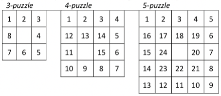
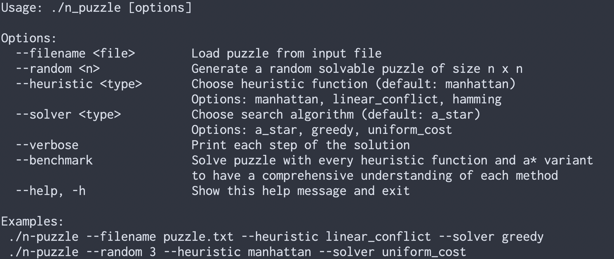
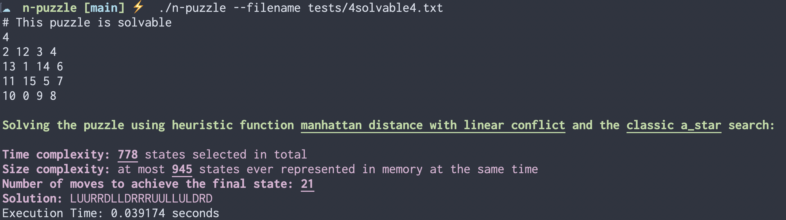
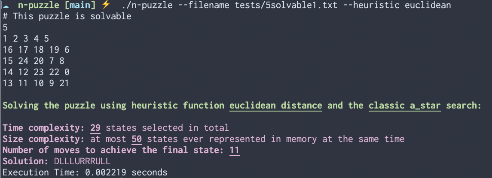

# N-Puzzle Solver

A modern C++ implementation of the N-Puzzle solver using A* search with multiple heuristics.

## Intro
N-Puzzle is played on a square grid of size n × n with the follwing rules:
- The board contains n² − 1 numbered tiles and one empty space
- The goal is to put all numbered tiles in a spiral order
- A move means to slide a numbered tile into the empty space, effectively swaps the tile and the empty

 
This program aims to find a valid sequence of moves in order to reach the final state.

## Features
- Solves n-puzzle of any dimension (3 * 3, 4 * 4, or bigger)

- Implements A* search algorithm and its variants (uniform cost and greedy search)

- Supports different heuristics:
  - Manhattan distance
  - Misplaced tiles
  - Linear conflict (if implemented)
  - chebyshev distance
  - Euclidean distance

- Displays solutions step by step

- Reads puzzle from files or generates one in specified dimension

- Handles unsolvable puzzles gracefully

## Requirements

- c++11 or newer
- python3

## Usage

## Output examples

